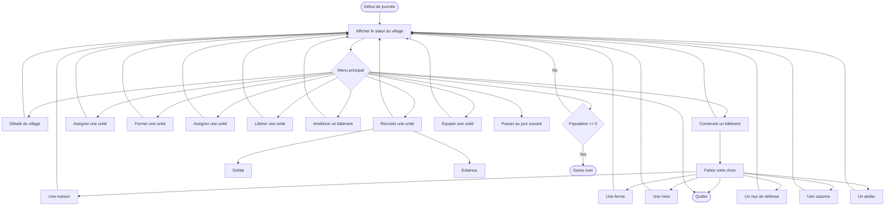
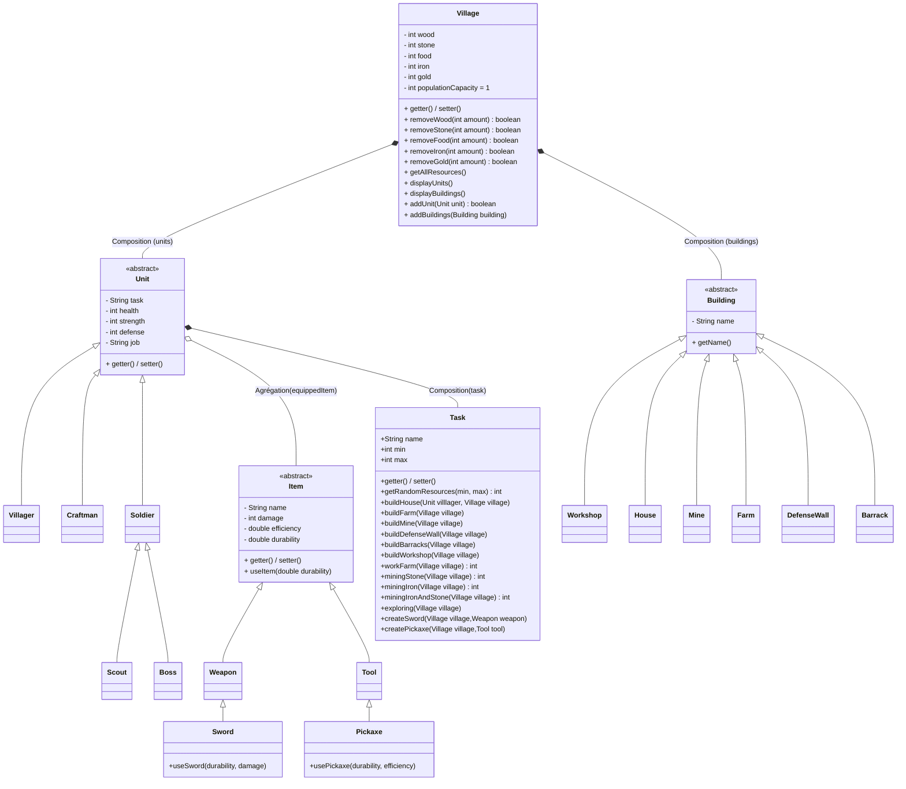

# jempire-2.0
Projet Jempire version 2.0

## UML Diagram for menuing

```mermaid
flowchart TD

A([Début de journée]) --> B[Afficher le statut du village]
B --> C{Menu principal}
C --> D[Détails du village]
D --> B
C --> E[Construire un bâtiment]
E --> Q[Faites votre choix]
Q --> R[Une maison]
R --> B
Q --> S[Une ferme]
S --> B
Q --> T[Une mine]
T --> B
Q --> U[Un mur de défense]
U --> B
Q --> V[Une caserne]
V --> B
Q --> W[Un atelier]
W --> B
Q --> P[Quitter]
E --> B
C --> F[Assigner une unité]
F --> B
C --> G[Former une unité]
G --> B
C --> H[Assigner une unité]
H --> B
C --> I[Libérer une unité]
I  --> B
C --> J[Améliorer un bâtiment]
J --> B
C --> K[Recruter une unité]
K --> Y[Soldat]
K --> Z[Eclaireur]
K --> B
C --> L[Equiper une unité]
L --> B
C --> M[Passer au jour suivant]
C --> N{Population <= 0}
N -- Yes --> O([Game over])
N -- No --> B
C --> P([Quitter])
	
```
______

## UML diagram for global project

```mermaid
classDiagram 

	Village *-- Building : Composition (buildings)
	Village *-- Unit : Composition (units)

class Village {
	- int wood
	- int stone
	- int food
	- int iron
	- int gold
	- int populationCapacity = 1
	+ getter() / setter()
	+ removeWood(int amount) boolean
	+ removeStone(int amount) boolean
	+ removeFood(int amount) boolean
	+ removeIron(int amount) boolean
	+ removeGold(int amount) boolean
	+ getAllResources()
	+ displayUnits()
	+ displayBuildings()
	+ addUnit(Unit unit) boolean
	+ addBuildings(Building building)
}

	Unit <|-- Villager
	Unit <|-- Craftman
	Unit <|-- Soldier
	Soldier <|-- Scout
	Soldier <|-- Boss
	
	Unit o-- Item : Agrégation(equippedItem)
	Unit *-- Task : Composition(task)
	
	class Unit { 
		<<abstract>>
		- String task
		- int health
		- int strength
		- int defense
		- String job
		+ getter() / setter()
	}
	
	class Villager {
	}
	
	class Soldier {
	}
	
	class Scout {
	}
	
	class Craftman {
	}
	
	class Boss {
	}
	
	Item <|-- Weapon
	Item <|-- Tool
	Weapon <|-- Sword
	Tool <|-- Pickaxe
	
	class Item {
		<<abstract>>
		- String name
		- int damage
		- double efficiency
		- double durability
		+ getter() / setter()
		+ useItem(double durability)  
	}
	
	class Weapon {
	}
	
	class Tool {
	}
	
	class Sword {
		+useSword(durability, damage)
	}
	
	class Pickaxe {
		+usePickaxe(durability, efficiency)
	}
	
	Building <|-- Workshop
	Building <|-- House
	Building <|-- Mine
	Building <|-- Farm
	Building <|-- DefenseWall
	Building <|-- Barrack

class Building {
	<<abstract>>
	- String name
	+ getName()
}

	class Workshop {
	}


	class Mine {
	}

	class House {
	}

	class Farm {
	}

	class DefenseWall {
	}

	class Barrack {
	}

class Task {
	+String name
	+int min
	+int max
	+getter() / setter()
	+getRandomResources(min, max) int
	+buildHouse(Unit villlager, Village village)
	+buildFarm(Village village)
	+buildMine(Village village)
	+buildDefenseWall(Village village)
	+buildBarracks(Village village)
	+buildWorkshop(Village village)
	+workFarm(Village village) int
	+miningStone(Village village) int
	+miningIron(Village village) int
	+miningIronAndStone(Village village) int
	+exploring(Village village)
	+createSword(Village village,Weapon weapon)
	+createPickaxe(Village village,Tool tool)
}
```
